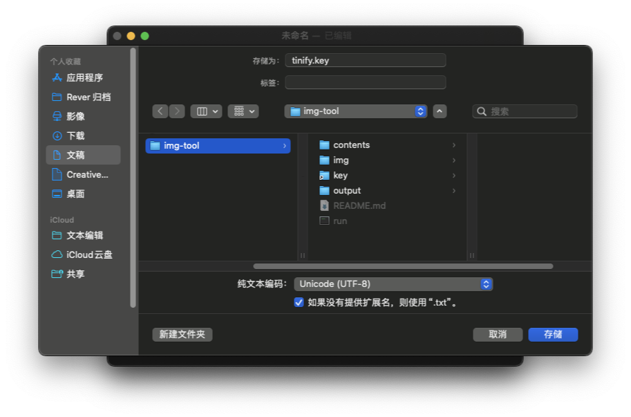

# img-tool
图片自动化压缩和裁剪工具

### 安装
#### 1. 安装主程序和脚本
复制以下命令到终点运行
```shell
TARGET_DIR="$HOME/Documents/img-tool" #此处设置安装目录
git clone https://github.com/kailous/img-tool "$TARGET_DIR"
cd "$TARGET_DIR"
chmod 777 run
echo "安装完成！"
open "$TARGET_DIR"
```
#### 2. key 的获取
前往 [Tinyify控制台](https://tinify.com/dashboard/api) 获取 API key，每个 key 每月有 500张免费，多余的需要付费使用，或者更换其他账号获取新的key。

#### 3. 制作 key 文件
新建文本文档，顶部栏 > 格式 > 制作纯文本，或者按快捷键 `⇧⌘T( shift + command + T )` 进入纯文本编辑模式。
输入上一步获取到的 API key，保存的时候,命名为 tinify.key ,将文件保存到程序根目录的 key 文件夹中。

### 使用
将需要压缩的图片放在 img 中,