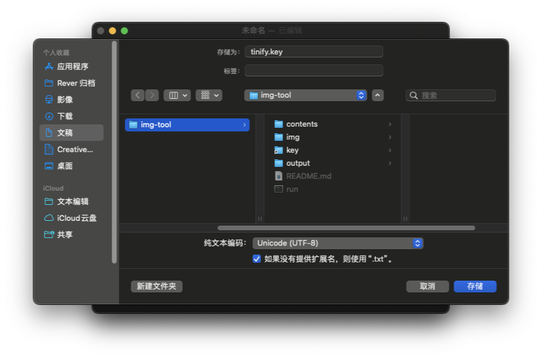

# key
前往 [Tinyify控制台](https://tinify.com/dashboard/api) 获取 `API key`，每个 `key` 每月有 500 张免费，多余的需要付费使用，或者更换其他账号获取新的 `key` 。

新建文本文档，`顶部栏 > 格式 > 制作纯文本`，或者按快捷键 `⇧⌘T( shift + command + T )` 进入`纯文本编辑模式`。
输入上一步获取到的 `API key`，保存的时候,命名为 `tinify.key` ,将文件保存到当前文件夹中。
